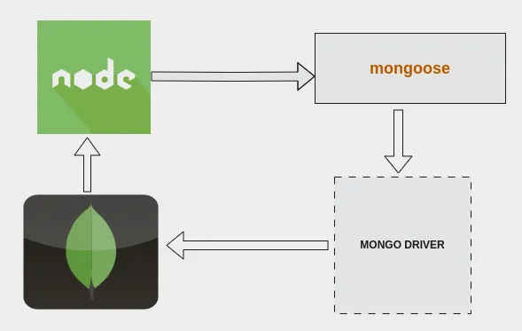

# Manipulação de Artigos com Node e MongoDB

Esse projeto realiza a implementação do Node JS com o MongoDB em um Banco de dados.

  

## Sumário

- [Tecnologias Utilizadas](#tecnologias-utilizadas)
- [Status](#status)
- [Descrição](#descrição)
- [Funcionalidades](#funcionalidades)
- [Explicação](#explicação)
- [Como Usar](#como-usar)
- [Autor](#autor)

## Tecnologias Utilizadas

  

    
  

  

    
  

## Status

## Descrição

Este projeto utiliza o MongoDb, mais precisamente o mongoose, para comunicação dop BackEnd em Node JS com o Banco de dados NoSQL.

## Funcionalidades

Com esse projeto podemos realizar as operações basicas de CRUD (CREATE, READ. UPDATE, DELETE) em um banco de dados.

## Explicação

Este projeto possui apenas o Back-end fito, então para realizar a operação de criação devemos adicionar os dados via código, para posteriormente realizar as outras operações.

Futuramente pretendo transformar este projeto em uma API e adicionar o Front end.

## Estrutura do Projeto

Models/

- Users.js

Controllers/

- Create.js
- Read.js
- Update.js
- Delete.js
- index.js

## Como Usar

1. git clone `https://github.com/dgusfr/ArticleMongodbDB`
2. npm install
3. node index.js

## Autor

Desenvolvido por Diego Franco
